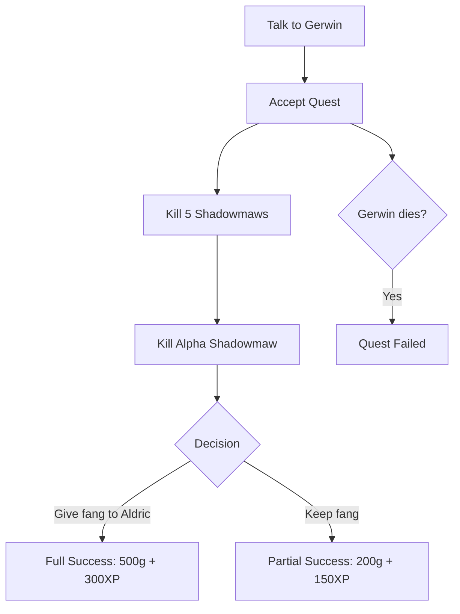

---
sidebar_position: 5
title: "Advanced Quest"
description: "Creating an advanced quest with multiple endings, two NPCs, custom monsters, and a kill counter."
---

# Advanced Quest

In this tutorial you will learn how to build a complex quest involving **two NPCs**, a **custom monster**, a **kill counter**, and **multiple endings** depending on player choices.

:::info Prerequisites
Before starting this tutorial, make sure you've completed:

- [My First NPC](./first-npc.md) - creating NPCs and daily routines
- [My First Quest](./first-quest.md) - basic quest log, dialog system, and mission variables
  :::

## Quest Design: "The Beast Hunt"

Here is the quest outline:

- **Gerwin** (a hunter) tells the player that **Shadowmaws** - dangerous creatures - are terrorizing the area. He asks the player to kill **5 Shadowmaws** and their leader, the **Alpha Shadowmaw**.
- **Aldric** (the village elder) provides additional context and offers a bonus reward if the player brings back the Alpha's fang as a trophy.
- The player must kill all 5 regular Shadowmaws (tracked individually) and then slay the Alpha.
- **Three endings:**
  1. **Full success** - Kill all creatures and return the Alpha's fang to Aldric → maximum reward
  2. **Partial success** - Kill all creatures but keep the fang for yourself → lesser reward from Gerwin, Aldric is disappointed
  3. **Failure** - If Gerwin dies before the quest is completed → quest fails



## Step 1: Mission Variables and Constants

Define variables to track quest progress in your constants file (e.g., `Story_Globals.d`):

```daedalus
// ============================================================
// THE BEAST HUNT - Mission Variables
// ============================================================

// Main quest state: 0 / LOG_RUNNING / LOG_SUCCESS / LOG_FAILED
var int MIS_BeastHunt;

// Kill counter - used ONLY for the on-screen HUD message
// The real completion check uses Npc_IsDead() on each monster
var int BeastHunt_BodyCount;

// Did the player give the fang to Aldric? 0 = no, 1 = yes
var int BeastHunt_FangGiven;

// Quest log topic name
const string TOPIC_BeastHunt = "The Beast Hunt";

// Text constant for HUD message
const string PRINT_ShadowmawsLeft = " - Shadowmaws remaining";
```

:::tip How the original Gothic counts kills
In Gothic, kill quests use **two separate systems**:

1. A **body count variable** (`BeastHunt_BodyCount`) - only for displaying the HUD countdown message
2. **`Npc_IsDead()` checks** on each individual monster instance - the real completion condition

This is why each quest monster needs its own **unique named instance** (e.g., `Shadowmaw_01`, `Shadowmaw_02`). You can't track individual kills with generic instances.
:::

## Step 2: The Custom Monster - Shadowmaw

### Monster Prototype

Monsters in Gothic don't use `Npc_Default` - each species defines its own **prototype**. Create `MST_Shadowmaw.d` in `Story/NPC/Monster/`:

```daedalus
// ============================================================
// PROTOTYPE - Shadowmaw base template
// ============================================================
prototype MST_DEFAULT_SHADOWMAW (C_NPC)
{
    name[0]     = "Shadowmaw";
    guild       = GIL_WOLF;
    aivar[AIV_MM_REAL_ID] = ID_WOLF;

    level       = 12;

    // --- Attributes ---
    attribute[ATR_STRENGTH]      = 60;
    attribute[ATR_DEXTERITY]     = 40;
    attribute[ATR_HITPOINTS_MAX] = 120;
    attribute[ATR_HITPOINTS]     = 120;
    attribute[ATR_MANA_MAX]      = 0;
    attribute[ATR_MANA]          = 0;

    // --- Protection ---
    protection[PROT_BLUNT]  = 40;
    protection[PROT_EDGE]   = 40;
    protection[PROT_POINT]  = 10;
    protection[PROT_FIRE]   = 20;
    protection[PROT_FLY]    = 40;
    protection[PROT_MAGIC]  = 10;

    damagetype = DAM_EDGE;

    // --- Combat AI ---
    fight_tactic = FAI_WOLF;

    // --- Senses ---
    senses       = SENSE_HEAR | SENSE_SEE | SENSE_SMELL;
    senses_range = PERC_DIST_MONSTER_ACTIVE_MAX;

    // --- Behavior ---
    aivar[AIV_MM_THREATENBEFOREATTACK] = TRUE;
    aivar[AIV_MM_FOLLOWTIME]           = FOLLOWTIME_LONG;
    aivar[AIV_MM_FOLLOWINWATER]        = TRUE;
    aivar[AIV_MM_PACKHUNTER]           = TRUE;

    // --- Daily routine: roam all day ---
    start_aistate               = ZS_MM_AllScheduler;
    aivar[AIV_MM_ROAMSTART]     = ONLYROUTINE;
};
```

| Field                                   | Description                                                     |
| --------------------------------------- | --------------------------------------------------------------- |
| `guild = GIL_WOLF`                      | Uses the wolf guild (determines hostility, AI behavior)         |
| `aivar[AIV_MM_REAL_ID]`                 | Monster type identifier used by the AI system                   |
| `fight_tactic = FAI_WOLF`               | Uses wolf fight AI patterns (lunges, dodges)                    |
| `senses`                                | Can hear, see, AND smell - detects the player from further away |
| `aivar[AIV_MM_PACKHUNTER]`              | Attacks together with nearby pack members                       |
| `start_aistate`                         | `ZS_MM_AllScheduler` is the universal monster routine scheduler |
| `aivar[AIV_MM_ROAMSTART] = ONLYROUTINE` | Roams around waypoints all day                                  |

### Visual Setup Function

Monsters use a dedicated visual function instead of `B_SetNpcVisual`:

```daedalus
func void B_SetVisuals_Shadowmaw ()
{
    // Using the wolf model/animations as a base
    Mdl_SetVisual      (self, "Wolf.mds");
    Mdl_SetVisualBody  (self, "Wol_Body", DEFAULT, DEFAULT, "", DEFAULT, DEFAULT, -1);
};
```

:::info
Gothic modding reuses existing models. The Shadowmaw uses the wolf model (`Wolf.mds` / `Wol_Body`) since adding new 3D models requires additional tools. In a full mod you could create custom meshes, but for scripting tutorials the existing assets work perfectly.
:::

### Quest Monster Instances - Each One Must Be Unique!

This is the key difference from a simple monster spawn. For kill-counting quests, **every monster must be a unique named instance**, so you can check `Npc_IsDead()` on each one individually:

```daedalus
// ============================================================
// 5 unique quest Shadowmaws - each one is individually trackable
// They all have the same stats, but separate instance names
// ============================================================
instance Shadowmaw_01 (MST_DEFAULT_SHADOWMAW)
{
    B_SetVisuals_Shadowmaw ();
    Npc_SetToFistMode (self);
    CreateInvItems (self, ItAt_WolfFur, 1);
};

instance Shadowmaw_02 (MST_DEFAULT_SHADOWMAW)
{
    B_SetVisuals_Shadowmaw ();
    Npc_SetToFistMode (self);
    CreateInvItems (self, ItAt_WolfFur, 1);
};

instance Shadowmaw_03 (MST_DEFAULT_SHADOWMAW)
{
    B_SetVisuals_Shadowmaw ();
    Npc_SetToFistMode (self);
    CreateInvItems (self, ItAt_WolfFur, 1);
};

instance Shadowmaw_04 (MST_DEFAULT_SHADOWMAW)
{
    B_SetVisuals_Shadowmaw ();
    Npc_SetToFistMode (self);
    CreateInvItems (self, ItAt_WolfFur, 1);
};

instance Shadowmaw_05 (MST_DEFAULT_SHADOWMAW)
{
    B_SetVisuals_Shadowmaw ();
    Npc_SetToFistMode (self);
    CreateInvItems (self, ItAt_WolfFur, 1);
};
```

:::danger Why not use a single generic instance?
You might think: "Why not create one `instance Shadowmaw(...)` and spawn it 5 times?" Because then you **cannot check** if a specific one is dead. `Npc_IsDead()` requires a reference to a specific NPC - if you spawn 5 copies of the same instance, the engine can't distinguish between them.

This is exactly how the original Gothic 2 handles it - the Canyon Razor quest in the addon uses 10 unique instances (`CanyonRazor01` through `CanyonRazor10`), all with identical stats but separate names.
:::

### Alpha Shadowmaw - The Unique Boss

The Alpha is a stronger variant with scaled-up size and better loot:

```daedalus
// ============================================================
// Alpha Shadowmaw - unique boss monster
// ============================================================
instance Shadowmaw_Alpha (MST_DEFAULT_SHADOWMAW)
{
    name[0] = "Alpha Shadowmaw";
    level   = 22;

    // --- Much stronger stats ---
    attribute[ATR_STRENGTH]      = 120;
    attribute[ATR_DEXTERITY]     = 80;
    attribute[ATR_HITPOINTS_MAX] = 350;
    attribute[ATR_HITPOINTS]     = 350;

    // --- Better protection ---
    protection[PROT_BLUNT]  = 80;
    protection[PROT_EDGE]   = 80;
    protection[PROT_POINT]  = 40;
    protection[PROT_FIRE]   = 50;
    protection[PROT_FLY]    = 80;
    protection[PROT_MAGIC]  = 30;

    // --- Does NOT hunt in packs (lone alpha) ---
    aivar[AIV_MM_PACKHUNTER] = FALSE;

    B_SetVisuals_Shadowmaw ();

    // Make the Alpha visually bigger - 30% larger than normal
    Mdl_SetModelScale (self, 1.3, 1.3, 1.3);

    Npc_SetToFistMode (self);

    // Unique loot: the Alpha Fang (mission item)
    CreateInvItems (self, ItMi_AlphaFang, 1);
    CreateInvItems (self, ItAt_WolfFur, 3);
};
```

| Difference from regular                  | Description                              |
| ---------------------------------------- | ---------------------------------------- |
| `name[0] = "Alpha Shadowmaw"`            | Distinct display name                    |
| `level = 22`                             | Much higher level                        |
| All attributes doubled+                  | Significantly harder to kill             |
| `AIV_MM_PACKHUNTER = FALSE`              | Fights alone (dramatic boss encounter)   |
| `Mdl_SetModelScale(self, 1.3, 1.3, 1.3)` | 30% larger model - visually intimidating |
| Drops `ItMi_AlphaFang`                   | Unique trophy item needed for the quest  |

:::tip
`Mdl_SetModelScale(self, x, y, z)` is the easiest way to make a unique variant of any monster visually distinct. Values above `1.0` increase size, below `1.0` decrease it.
:::

## Step 3: The Trophy Item - Alpha Fang

Create the mission item in `Items/MissionItems.d`:

```daedalus
instance ItMi_AlphaFang (C_Item)
{
    name        = "Alpha Shadowmaw's Fang";
    mainflag    = ITEM_KAT_NONE;
    flags       = ITEM_MISSION;
    value       = 0;
    visual      = "ItAt_Teeth.3ds";
    material    = MAT_STONE;

    description = name;
    TEXT[1]     = "A massive fang from the Alpha.";
    TEXT[5]     = "Mission Item";
};
```

## Step 4: Kill Tracking - The Gothic Way

This is the most important part. In Gothic, kill tracking uses **three helper functions**. Create `Story/B_Content/B_CountShadowmaw.d`:

### Function 1: `C_IAmShadowmaw` - Identify a Quest Monster

This function checks if a given NPC is one of your quest monsters. It uses `Hlp_GetNpc()` and `Hlp_GetInstanceID()` - both are **vanilla Daedalus functions** available without any libraries:

```daedalus
// ============================================================
// Checks if the given NPC is one of the 5 quest Shadowmaws
// or the Alpha. Uses Hlp_GetInstanceID to compare instance IDs.
// ============================================================
func int C_IAmShadowmaw (var C_NPC slf)
{
    var C_NPC sm01; sm01 = Hlp_GetNpc (Shadowmaw_01);
    var C_NPC sm02; sm02 = Hlp_GetNpc (Shadowmaw_02);
    var C_NPC sm03; sm03 = Hlp_GetNpc (Shadowmaw_03);
    var C_NPC sm04; sm04 = Hlp_GetNpc (Shadowmaw_04);
    var C_NPC sm05; sm05 = Hlp_GetNpc (Shadowmaw_05);
    var C_NPC alpha; alpha = Hlp_GetNpc (Shadowmaw_Alpha);

    if (Hlp_GetInstanceID (slf) == Hlp_GetInstanceID (sm01))
    || (Hlp_GetInstanceID (slf) == Hlp_GetInstanceID (sm02))
    || (Hlp_GetInstanceID (slf) == Hlp_GetInstanceID (sm03))
    || (Hlp_GetInstanceID (slf) == Hlp_GetInstanceID (sm04))
    || (Hlp_GetInstanceID (slf) == Hlp_GetInstanceID (sm05))
    || (Hlp_GetInstanceID (slf) == Hlp_GetInstanceID (alpha))
    {
        return TRUE;
    };

    return FALSE;
};
```

| Function                 | Description                                                 |
| ------------------------ | ----------------------------------------------------------- |
| `Hlp_GetNpc(instance)`   | Returns a reference to the NPC with the given instance name |
| `Hlp_GetInstanceID(npc)` | Returns the unique numeric instance ID of an NPC            |

:::info Why not just compare names?
NPC names like `"Shadowmaw"` can be shared by many NPCs. `Hlp_GetInstanceID` compares the **script instance**, which is always unique - `Shadowmaw_01` and `Shadowmaw_02` will have different IDs even though their `name[0]` is the same.
:::

### Function 2: `C_AllShadowmawsDead` - Check Quest Completion

This is the **real completion check**, using `Npc_IsDead()` on every individual monster:

```daedalus
// ============================================================
// Returns TRUE only when ALL 6 monsters are dead
// (5 regular + 1 alpha)
// ============================================================
func int C_AllShadowmawsDead ()
{
    if (Npc_IsDead (Shadowmaw_01))
    && (Npc_IsDead (Shadowmaw_02))
    && (Npc_IsDead (Shadowmaw_03))
    && (Npc_IsDead (Shadowmaw_04))
    && (Npc_IsDead (Shadowmaw_05))
    && (Npc_IsDead (Shadowmaw_Alpha))
    {
        return TRUE;
    };

    return FALSE;
};
```

### Function 3: `B_CountShadowmaw` - Display HUD Counter

Shows the remaining count on screen using `AI_PrintScreen`:

```daedalus
// ============================================================
// Displays "X - Shadowmaws remaining" on the game screen
// ============================================================
func void B_CountShadowmaw ()
{
    var string countText;
    var string countLeft;

    // Total quest monsters = 6 (5 regular + 1 alpha)
    countLeft = IntToString (6 - BeastHunt_BodyCount);
    countText = ConcatStrings (countLeft, PRINT_ShadowmawsLeft);

    AI_PrintScreen (countText, -1, YPOS_GOLDGIVEN, FONT_ScreenSmall, 2);
};
```

| Function                                     | Description                                         |
| -------------------------------------------- | --------------------------------------------------- |
| `AI_PrintScreen(text, x, y, font, duration)` | Displays text on the game screen (AI queue version) |
| `YPOS_GOLDGIVEN`                             | Built-in Y-position constant for HUD messages       |

### Hooking into the Death State

In Gothic, the counting happens in `ZS_Dead` - the state function that **every NPC** (including monsters) enters when they die. Add this at the beginning of `ZS_Dead()` in `AI/Human/ZS_Human/ZS_Dead.d`:

```daedalus
func void ZS_Dead ()
{
    // === BEAST HUNT - kill counting ===
    if (C_IAmShadowmaw (self))
    {
        // Always increment the counter (even before quest starts)
        BeastHunt_BodyCount = BeastHunt_BodyCount + 1;

        // But only show the HUD message when the quest is active
        if (MIS_BeastHunt == LOG_RUNNING)
        {
            B_CountShadowmaw ();
        };
    };

    // ... rest of the original ZS_Dead function ...
};
```

:::warning Why count always, but show HUD only when active?
The body count **always increments** regardless of quest state. This is intentional - if the player kills some Shadowmaws before accepting the quest, the counter stays accurate. The actual quest completion uses `Npc_IsDead()` which works regardless of when the monster was killed.

The HUD message (`B_CountShadowmaw`) is shown only during `LOG_RUNNING` so the player isn't confused by countdown messages before they know about the quest.
:::

## Step 5: NPC #1 - Gerwin the Hunter

Create `Story/NPC/JGR_901_Gerwin.d` (JGR = Jäger = hunter):

```daedalus
instance JGR_901_Gerwin (Npc_Default)
{
    name        = "Gerwin";
    guild       = GIL_OUT;
    id          = 901;
    voice       = 10;
    flags       = 0;
    npctype     = NPCTYPE_MAIN;

    level       = 15;
    attribute[ATR_STRENGTH]      = 80;
    attribute[ATR_DEXTERITY]     = 60;
    attribute[ATR_HITPOINTS_MAX] = 200;
    attribute[ATR_HITPOINTS]     = 200;

    fight_tactic = FAI_HUMAN_STRONG;

    EquipItem (self, ItMw_1h_Vlk_Axe);
    CreateInvItems (self, ItMi_Gold, 200);

    B_SetNpcVisual (self, MALE, "Hum_Head_FatBald", Face_N_Tough_Okyl, BodyTex_N, ITAR_Djg_L);
    Mdl_SetModelFatness (self, 0);
    Mdl_ApplyOverlayMds (self, "Humans_Relaxed.mds");

    B_GiveNpcTalents (self);
    B_SetFightSkills (self, 50);

    daily_routine = Rtn_Start_901;
};

func void Rtn_Start_901 ()
{
    TA_Stand_Guarding (06, 00, 20, 00, "NW_BIGFARM_PATH_01");
    TA_Sleep          (20, 00, 06, 00, "NW_BIGFARM_STABLE_SLEEP_01");
};
```

## Step 6: NPC #2 - Aldric the Village Elder

Create `Story/NPC/VLK_902_Aldric.d` (VLK = Volk = citizen):

```daedalus
instance VLK_902_Aldric (Npc_Default)
{
    name        = "Aldric";
    guild       = GIL_OUT;
    id          = 902;
    voice       = 5;
    flags       = 0;
    npctype     = NPCTYPE_MAIN;

    level       = 3;
    attribute[ATR_STRENGTH]      = 15;
    attribute[ATR_DEXTERITY]     = 10;
    attribute[ATR_HITPOINTS_MAX] = 60;
    attribute[ATR_HITPOINTS]     = 60;

    fight_tactic = FAI_HUMAN_COWARD;

    CreateInvItems (self, ItMi_Gold, 500);

    B_SetNpcVisual (self, MALE, "Hum_Head_Pony", Face_N_OldBald_Jeremiah, BodyTex_N, ITAR_Bau_L);
    Mdl_SetModelFatness (self, 1);
    Mdl_ApplyOverlayMds (self, "Humans_Relaxed.mds");

    B_GiveNpcTalents (self);
    B_SetFightSkills (self, 10);

    daily_routine = Rtn_Start_902;
};

func void Rtn_Start_902 ()
{
    TA_Stand_ArmsCrossed (07, 00, 12, 00, "NW_BIGFARM_HUT_01");
    TA_Sit_Bench         (12, 00, 14, 00, "NW_BIGFARM_HUT_BENCH");
    TA_Smalltalk         (14, 00, 20, 00, "NW_BIGFARM_HUT_01");
    TA_Sleep             (20, 00, 07, 00, "NW_BIGFARM_HUTINSIDE_BED");
};
```

## Step 7: Dialogs - Gerwin (Quest Giver)

Create `Story/Dialoge/DIA_JGR_901_Gerwin.d`:

### Exit Dialog

```daedalus
instance DIA_Gerwin_EXIT (C_INFO)
{
    npc         = JGR_901_Gerwin;
    nr          = 999;
    condition   = DIA_Gerwin_EXIT_Condition;
    information = DIA_Gerwin_EXIT_Info;
    permanent   = TRUE;
    description = DIALOG_ENDE;
};

func int DIA_Gerwin_EXIT_Condition () { return TRUE; };
func void DIA_Gerwin_EXIT_Info () { AI_StopProcessInfos (self); };
```

### Greeting - Gerwin Approaches the Player

```daedalus
instance DIA_Gerwin_Hallo (C_INFO)
{
    npc         = JGR_901_Gerwin;
    nr          = 1;
    condition   = DIA_Gerwin_Hallo_Condition;
    information = DIA_Gerwin_Hallo_Info;
    permanent   = FALSE;
    important   = TRUE;
};

func int DIA_Gerwin_Hallo_Condition ()
{
    if (MIS_BeastHunt == 0)
    {
        return TRUE;
    };
};

func void DIA_Gerwin_Hallo_Info ()
{
    AI_Output (self, other, "DIA_Gerwin_Hallo_10_01"); //You there! You look like you can handle a blade.
    AI_Output (self, other, "DIA_Gerwin_Hallo_10_02"); //We've got a serious problem. Beasts have been attacking our livestock every night.
    AI_Output (other, self, "DIA_Gerwin_Hallo_15_01"); //What kind of beasts?
    AI_Output (self, other, "DIA_Gerwin_Hallo_10_03"); //We call them Shadowmaws. Nasty things, hunt in packs. And there's a big one leading them - an Alpha.
};
```

### Accepting the Quest

```daedalus
instance DIA_Gerwin_AcceptQuest (C_INFO)
{
    npc         = JGR_901_Gerwin;
    nr          = 2;
    condition   = DIA_Gerwin_AcceptQuest_Condition;
    information = DIA_Gerwin_AcceptQuest_Info;
    permanent   = FALSE;
    description = "I'll take care of your beast problem.";
};

func int DIA_Gerwin_AcceptQuest_Condition ()
{
    if (MIS_BeastHunt == 0)
    {
        return TRUE;
    };
};

func void DIA_Gerwin_AcceptQuest_Info ()
{
    AI_Output (other, self, "DIA_Gerwin_AcceptQuest_15_01"); //I'll deal with these Shadowmaws. How many are there?
    AI_Output (self, other, "DIA_Gerwin_AcceptQuest_10_01"); //I've counted about five of them, plus the Alpha. Kill them all and I'll pay you well.
    AI_Output (self, other, "DIA_Gerwin_AcceptQuest_10_02"); //You should also talk to Aldric, the village elder. He knows more about these creatures.

    // === START QUEST ===
    MIS_BeastHunt = LOG_RUNNING;
    BeastHunt_FangGiven = FALSE;

    Log_CreateTopic (TOPIC_BeastHunt, LOG_MISSION);
    Log_SetTopicStatus (TOPIC_BeastHunt, LOG_RUNNING);
    B_LogEntry (TOPIC_BeastHunt,
        "Gerwin the hunter asked me to kill 5 Shadowmaws and their Alpha. I should also talk to Aldric, the village elder."
    );

    AI_StopProcessInfos (self);
};
```

### About the Shadowmaws - Permanent Progress Dialog

This is a **permanent** dialog (like Greg's `DIA_ADDON_GREG_ABOUTCANYON` in the original game). It checks progress and unlocks the completion option when all monsters are dead:

```daedalus
instance DIA_Gerwin_AboutHunt (C_INFO)
{
    npc         = JGR_901_Gerwin;
    nr          = 5;
    condition   = DIA_Gerwin_AboutHunt_Condition;
    information = DIA_Gerwin_AboutHunt_Info;
    permanent   = TRUE;
    description = "About the Shadowmaws...";
};

func int DIA_Gerwin_AboutHunt_Condition ()
{
    if (MIS_BeastHunt == LOG_RUNNING)
    {
        return TRUE;
    };
};

func void DIA_Gerwin_AboutHunt_Info ()
{
    // Check if ALL monsters are dead using Npc_IsDead on each one
    if (C_AllShadowmawsDead ())
    {
        AI_Output (other, self, "DIA_Gerwin_AboutHunt_15_01"); //The Shadowmaws are dead. Every last one of them, including the Alpha.
        AI_Output (self, other, "DIA_Gerwin_AboutHunt_10_01"); //You actually did it! The forest is safe again.

        // --- Reward depends on whether the fang was given to Aldric ---
        if (BeastHunt_FangGiven == TRUE)
        {
            // ENDING 1: Full success - fang given to Aldric
            AI_Output (self, other, "DIA_Gerwin_AboutHunt_10_02"); //Aldric told me you brought him the Alpha's fang. You've earned every coin of this.

            CreateInvItems (self, ItMi_Gold, 500);
            B_GiveInvItems (self, other, ItMi_Gold, 500);
            B_GivePlayerXP (300);

            MIS_BeastHunt = LOG_SUCCESS;
            B_LogEntry (TOPIC_BeastHunt,
                "I killed all the Shadowmaws and gave the Alpha's fang to Aldric. Gerwin rewarded me handsomely - 500 gold and the gratitude of the entire village."
            );
        }
        else
        {
            // ENDING 2: Partial success - player kept the fang
            AI_Output (self, other, "DIA_Gerwin_AboutHunt_10_03"); //Good work. Here's your pay. Though I heard Aldric wanted that Alpha's fang...

            CreateInvItems (self, ItMi_Gold, 200);
            B_GiveInvItems (self, other, ItMi_Gold, 200);
            B_GivePlayerXP (150);

            MIS_BeastHunt = LOG_SUCCESS;
            B_LogEntry (TOPIC_BeastHunt,
                "I killed all the Shadowmaws but kept the Alpha's fang. Gerwin paid me 200 gold, but seemed disappointed I didn't help Aldric."
            );
        };
    }
    else
    {
        AI_Output (other, self, "DIA_Gerwin_AboutHunt_15_02"); //I'm still working on it.
        AI_Output (self, other, "DIA_Gerwin_AboutHunt_10_04"); //Keep at it. The forest isn't safe yet.
    };

    AI_StopProcessInfos (self);
};
```

:::info Why use a permanent dialog for completion?
This is the standard Gothic pattern - one permanent dialog option handles both "in progress" and "completed" states. The `C_AllShadowmawsDead()` function inside determines which branch runs. The option stays visible until the quest state changes to `LOG_SUCCESS`, at which point the condition (`MIS_BeastHunt == LOG_RUNNING`) hides it.
:::

### Gerwin's Death - Quest Failure

To detect when an NPC dies and fail the quest, add a check in `B_AssessMurder()`:

```daedalus
// Add this check inside B_AssessMurder():
func void B_BeastHunt_CheckGerwinDeath ()
{
    if (MIS_BeastHunt == LOG_RUNNING)
    && (Npc_IsDead (JGR_901_Gerwin))
    {
        // === ENDING 3: QUEST FAILURE ===
        MIS_BeastHunt = LOG_FAILED;
        Log_SetTopicStatus (TOPIC_BeastHunt, LOG_FAILED);
        B_LogEntry (TOPIC_BeastHunt,
            "Gerwin is dead. The beast hunt is over - there's nobody left to pay me."
        );
    };
};
```

| Function                                | Description                                            |
| --------------------------------------- | ------------------------------------------------------ |
| `Npc_IsDead(npc)`                       | Returns `TRUE` if the NPC is dead                      |
| `Log_SetTopicStatus(topic, LOG_FAILED)` | Moves the quest to the "Failed" section of the journal |

## Step 8: Dialogs - Aldric (Second NPC)

Create `Story/Dialoge/DIA_VLK_902_Aldric.d`:

### Exit Dialog

```daedalus
instance DIA_Aldric_EXIT (C_INFO)
{
    npc         = VLK_902_Aldric;
    nr          = 999;
    condition   = DIA_Aldric_EXIT_Condition;
    information = DIA_Aldric_EXIT_Info;
    permanent   = TRUE;
    description = DIALOG_ENDE;
};

func int DIA_Aldric_EXIT_Condition () { return TRUE; };
func void DIA_Aldric_EXIT_Info () { AI_StopProcessInfos (self); };
```

### Aldric Knows About the Beasts

```daedalus
instance DIA_Aldric_BeastInfo (C_INFO)
{
    npc         = VLK_902_Aldric;
    nr          = 3;
    condition   = DIA_Aldric_BeastInfo_Condition;
    information = DIA_Aldric_BeastInfo_Info;
    permanent   = FALSE;
    description = "Gerwin sent me. Tell me about the Shadowmaws.";
};

func int DIA_Aldric_BeastInfo_Condition ()
{
    if (MIS_BeastHunt == LOG_RUNNING)
    {
        return TRUE;
    };
};

func void DIA_Aldric_BeastInfo_Info ()
{
    AI_Output (other, self, "DIA_Aldric_BeastInfo_15_01"); //Gerwin sent me. He said you know more about these Shadowmaws.
    AI_Output (self, other, "DIA_Aldric_BeastInfo_05_01"); //Indeed. They've been coming from the dark forest to the east. The Alpha is the key - kill it, and the others scatter.
    AI_Output (self, other, "DIA_Aldric_BeastInfo_05_02"); //There's something else. The Alpha carries a fang of enormous power. If you bring it to me, I can use it to create a ward that will protect the village forever.
    AI_Output (self, other, "DIA_Aldric_BeastInfo_05_03"); //I'll pay you extra - on top of whatever Gerwin promised.

    B_LogEntry (TOPIC_BeastHunt,
        "Aldric told me the Alpha's fang has special properties. If I bring it to him, he can create a protective ward for the village. He promised an extra reward."
    );
};
```

### The Beasts Are Dead - Choice Dialog with `Info_AddChoice`

This dialog uses `Info_AddChoice` to give the player a branching decision within a single dialog. When the player tells Aldric the beasts are dead and has the Alpha's fang, two options appear: give the fang (bonus reward) or keep it. If the player doesn't have the fang, Aldric simply reacts with disappointment.

```daedalus
instance DIA_Aldric_BeastsDead (C_INFO)
{
    npc         = VLK_902_Aldric;
    nr          = 2;
    condition   = DIA_Aldric_BeastsDead_Condition;
    information = DIA_Aldric_BeastsDead_Info;
    permanent   = FALSE;
    description = "The Shadowmaws are dead.";
};

func int DIA_Aldric_BeastsDead_Condition ()
{
    if (MIS_BeastHunt == LOG_RUNNING)
    && (Npc_IsDead (Shadowmaw_Alpha))
    {
        return TRUE;
    };
};

func void DIA_Aldric_BeastsDead_Info ()
{
    AI_Output (other, self, "DIA_Aldric_BeastsDead_15_01"); //The Shadowmaws are dead, Aldric. All of them, including the Alpha.
    AI_Output (self, other, "DIA_Aldric_BeastsDead_05_01"); //That's incredible news! The village owes you a great debt.

    // If player has the fang - offer the choice
    if (Npc_HasItems (other, ItMi_AlphaFang) >= 1)
    {
        AI_Output (self, other, "DIA_Aldric_BeastsDead_05_02"); //Wait - do you have the Alpha's fang? I can feel its power from here. Will you give it to me?

        Info_ClearChoices (DIA_Aldric_BeastsDead);
        Info_AddChoice (DIA_Aldric_BeastsDead, "No, I'll keep the fang.",  DIA_Aldric_BeastsDead_KeepFang);
        Info_AddChoice (DIA_Aldric_BeastsDead, "Here, take the fang.",     DIA_Aldric_BeastsDead_GiveFang);
    }
    else
    {
        // Player doesn't have the fang (sold it, dropped it, etc.)
        AI_Output (self, other, "DIA_Aldric_BeastsDead_05_03"); //But without the Alpha's fang, I cannot create a ward to protect the village from future threats.
        AI_Output (self, other, "DIA_Aldric_BeastsDead_05_04"); //A shame. You had the chance to do real good here.
    };
};

// --- Choice: Give the fang ---
func void DIA_Aldric_BeastsDead_GiveFang ()
{
    AI_Output (other, self, "DIA_Aldric_GiveFang_15_01"); //Here's the Alpha's fang. Use it well.

    B_GiveInvItems (other, self, ItMi_AlphaFang, 1);

    AI_Output (self, other, "DIA_Aldric_GiveFang_05_01"); //Remarkable! I can feel the power in it. The village will be safe for generations.
    AI_Output (self, other, "DIA_Aldric_GiveFang_05_02"); //Thank you, hunter. Here - you've more than earned this.

    // Aldric's bonus reward
    CreateInvItems (self, ItMi_Gold, 300);
    B_GiveInvItems (self, other, ItMi_Gold, 300);
    B_GivePlayerXP (150);

    BeastHunt_FangGiven = TRUE;

    B_LogEntry (TOPIC_BeastHunt,
        "I gave the Alpha's fang to Aldric. He rewarded me with 300 gold. Now I should report back to Gerwin."
    );

    Info_ClearChoices (DIA_Aldric_BeastsDead);
    AI_StopProcessInfos (self);
};

// --- Choice: Keep the fang ---
func void DIA_Aldric_BeastsDead_KeepFang ()
{
    AI_Output (other, self, "DIA_Aldric_KeepFang_15_01"); //No. I'm keeping the fang for myself.
    AI_Output (self, other, "DIA_Aldric_KeepFang_05_01"); //That's... disappointing. The village could have been protected for generations.
    AI_Output (self, other, "DIA_Aldric_KeepFang_05_02"); //Very well. I suppose you've earned the right to decide.

    Info_ClearChoices (DIA_Aldric_BeastsDead);
    AI_StopProcessInfos (self);
};
```

| Function                                            | Description                                                                     |
| --------------------------------------------------- | ------------------------------------------------------------------------------- |
| `Info_ClearChoices(dialog_instance)`                | Removes all existing choices from a dialog - always call before adding new ones |
| `Info_AddChoice(dialog_instance, "text", function)` | Adds a selectable choice option that calls the given function when picked       |

:::info How `Info_AddChoice` works
`Info_AddChoice` replaces the normal dialog list with custom options. The pattern is:

1. Inside the main `_Info` function, call `Info_ClearChoices` to reset
2. Add choices with `Info_AddChoice` - each points to a separate function
3. Each choice function handles its own logic and ends with `Info_ClearChoices` + `AI_StopProcessInfos`

Note: choices are displayed in **reverse order** - the last `Info_AddChoice` call appears at the top of the list.
:::

## Step 9: Spawning Everything in the World

In `Startup.d`, insert all NPCs **and** monsters at world startup:

```daedalus
func void Startup_NewWorld ()
{
    // ... existing spawn code ...

    // === THE BEAST HUNT - NPCs ===
    Wld_InsertNpc (JGR_901_Gerwin,  "NW_BIGFARM_PATH_01");
    Wld_InsertNpc (VLK_902_Aldric,  "NW_BIGFARM_HUT_01");

    // === THE BEAST HUNT - Quest Shadowmaws ===
    Wld_InsertNpc (Shadowmaw_01,    "NW_BIGFARM01_RIGHTFIELD_02_MONSTER");
    Wld_InsertNpc (Shadowmaw_02,    "NW_BIGFARM01_RIGHTFIELD_02_MONSTER");
    Wld_InsertNpc (Shadowmaw_03,    "NW_BIGFARM01_RIGHTFIELD_02_MONSTER");
    Wld_InsertNpc (Shadowmaw_04,    "NW_BIGFARM01_RIGHTFIELD_02_MONSTER");
    Wld_InsertNpc (Shadowmaw_05,    "NW_BIGFARM01_RIGHTFIELD_02_MONSTER");

    // === THE BEAST HUNT - Alpha Shadowmaw (unique boss) ===
    Wld_InsertNpc (Shadowmaw_Alpha, "NW_BIGFARM01_RIGHTFIELD_02_MONSTER");
};
```

:::info Why spawn monsters at world startup?
The monsters are spawned at **world startup** because the system is designed to handle this correctly:

1. **`Npc_IsDead()` works regardless of quest state** - if the player kills some Shadowmaws before talking to Gerwin, those kills are still detected when the quest checks completion
2. **The body count (`BeastHunt_BodyCount`) always increments** in `ZS_Dead` - so even pre-quest kills are counted for the HUD display
3. **The HUD message only appears when the quest is active** - no confusing countdowns before the quest starts

This is exactly how the original Gothic 2 handles the Canyon Razor quest - some razors are spawned at world startup, and the quest completion check simply uses `Npc_IsDead()` on each one.
:::

:::warning
Remember: monsters are spawned using `Wld_InsertNpc`, not `Wld_InsertItem`. Even though they're monsters, they are technically NPCs in the engine. Each waypoint (e.g., `"NW_BIGFARM01_RIGHTFIELD_02_MONSTER"`) must exist in the `.zen` world file.
:::

## Step 10: Registration in Gothic.src

Add all new files to `Gothic.src` in the correct order:

```
_intern\Constants.d

Story\NPC\Monster\MST_Shadowmaw.d
Story\NPC\JGR_901_Gerwin.d
Story\NPC\VLK_902_Aldric.d

Items\MissionItems.d

Story\B_Content\B_CountShadowmaw.d

Story\Dialoge\DIA_JGR_901_Gerwin.d
Story\Dialoge\DIA_VLK_902_Aldric.d
```

:::danger
**File order in `Gothic.src` matters!** The compilation order must be:

1. Constants and variables first
2. Monster prototypes and instances
3. NPC definitions
4. Items
5. Helper functions (kill counting)
6. Dialog files last (they reference NPCs and items)
   :::

## Summary: What You've Learned

This advanced quest covered several important techniques:

| Technique                         | What It Does                                                               |
| --------------------------------- | -------------------------------------------------------------------------- |
| **Unique named instances**        | Each quest monster gets its own instance (`Shadowmaw_01..05`) for tracking |
| **`Hlp_GetInstanceID` matching**  | Identifies which monster died using vanilla Daedalus functions             |
| **`Npc_IsDead` completion**       | Checks each individual monster's death state for quest completion          |
| **Body count + HUD display**      | `AI_PrintScreen` shows remaining count, counter in `ZS_Dead`               |
| **Custom monster prototype**      | Creating a new monster species from scratch                                |
| **Unique boss monster**           | Using `Mdl_SetModelScale` and stat overrides for a boss variant            |
| **Multiple NPCs in one quest**    | Two NPCs with interconnected dialog trees                                  |
| **Multiple endings**              | Branching outcomes based on player decisions                               |
| **Permanent dialog for progress** | One dialog option handles both "in progress" and "completed"               |
| **Mission item as trophy**        | An item that determines the quest ending                                   |
| **NPC death detection**           | `Npc_IsDead` for quest failure conditions                                  |

### Complete File Structure

```
Scripts/Content/
├── _intern/Story_Globals.d                ← mission variables
├── Story/NPC/Monster/
│   └── MST_Shadowmaw.d                   ← prototype + 5 unique instances + Alpha
├── Story/NPC/
│   ├── JGR_901_Gerwin.d                   ← hunter NPC
│   └── VLK_902_Aldric.d                   ← village elder NPC
├── Items/
│   └── MissionItems.d                     ← ItMi_AlphaFang
├── Story/B_Content/
│   └── B_CountShadowmaw.d                ← C_IAmShadowmaw + C_AllShadowmawsDead + B_CountShadowmaw
├── AI/Human/ZS_Human/
│   └── ZS_Dead.d                          ← kill counting hook (edit existing file)
├── Story/Dialoge/
│   ├── DIA_JGR_901_Gerwin.d               ← all Gerwin dialogs
│   └── DIA_VLK_902_Aldric.d               ← all Aldric dialogs
└── Story/Startup.d                        ← Wld_InsertNpc calls
```
