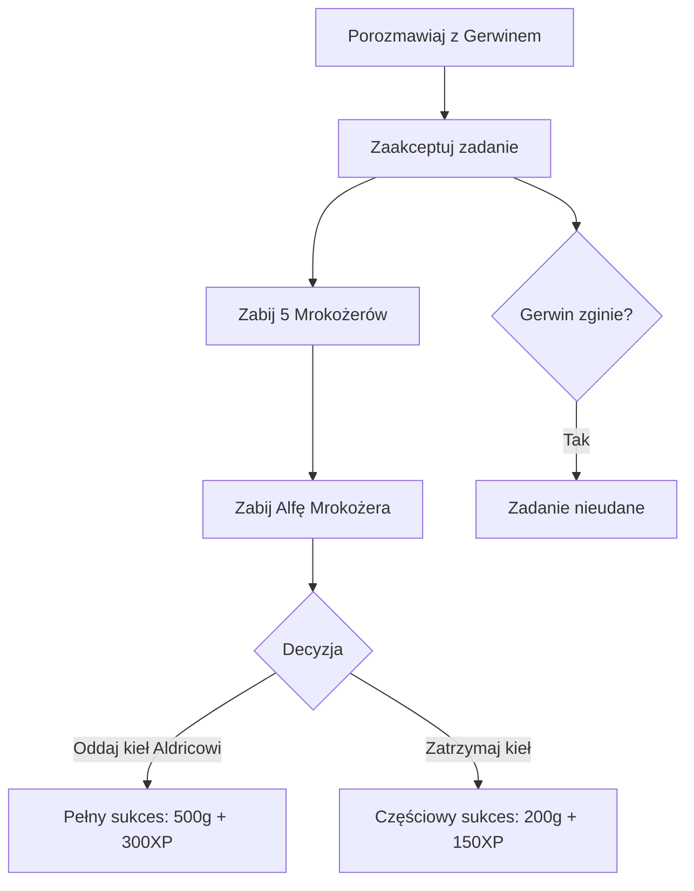

---
sidebar_position: 5
title: "Zaawansowane zadanie"
description: "Tworzenie zaawansowanego zadania z wieloma zakończeniami, dwoma NPC, własnymi potworami i licznikiem zabójstw."
---

# Zaawansowane zadanie

W tym poradniku nauczysz się budować złożone zadanie (quest) z udziałem **dwóch NPC**, **własnego potwora**, **licznika zabójstw** oraz **wieloma zakończeniami** zależnymi od wyborów gracza.

:::info Wymagania wstępne
Przed rozpoczęciem tego poradnika upewnij się, że ukończyłeś:

- [Mój pierwszy NPC](./first-npc.md) - tworzenie NPC i planów dnia
- [Moje pierwsze zadanie](./first-quest.md) - podstawy dziennika zadań, systemu dialogów i zmiennych misji
  :::

## Projekt zadania: „Polowanie na bestie"

Oto zarys zadania:

- **Gerwin** (łowca) mówi graczowi, że **Mrokożery** - niebezpieczne stworzenia - terroryzują okolicę. Prosi gracza o zabicie **5 Mrokożerów** i ich przywódcy, **Alfy Mrokożera**.
- **Aldric** (starszyzna wioski) dostarcza dodatkowych informacji i oferuje bonus, jeśli gracz przyniesie kieł Alfy jako trofeum.
- Gracz musi zabić wszystkie 5 zwykłych Mrokożerów (każdy śledzony indywidualnie), a następnie pokonać Alfę.
- **Trzy zakończenia:**
  1. **Pełny sukces** - Zabij wszystkie stworzenia i oddaj kieł Alfy Aldricowi → maksymalna nagroda
  2. **Częściowy sukces** - Zabij wszystkie stworzenia, ale zatrzymaj kieł dla siebie → mniejsza nagroda od Gerwina, Aldric jest rozczarowany
  3. **Porażka** - Jeśli Gerwin zginie przed ukończeniem zadania → zadanie zostaje przerwane



## Krok 1: Zmienne misji i stałe

Zdefiniuj zmienne do śledzenia postępu zadania w pliku ze stałymi (np. `Story_Globals.d`):

```daedalus
// ============================================================
// POLOWANIE NA BESTIE - Zmienne misji
// ============================================================

// Główny stan zadania: 0 / LOG_RUNNING / LOG_SUCCESS / LOG_FAILED
var int MIS_BeastHunt;

// Licznik zabójstw - używany TYLKO do wyświetlania na HUD
// Prawdziwe sprawdzenie ukończenia używa Npc_IsDead() na każdym potworze
var int BeastHunt_BodyCount;

// Czy gracz oddał kieł Aldricowi? 0 = nie, 1 = tak
var int BeastHunt_FangGiven;

// Nazwa tematu w dzienniku zadań
const string TOPIC_BeastHunt = "Polowanie na bestie";

// Stała tekstowa dla wiadomości HUD
const string PRINT_ShadowmawsLeft = " - Mrokozerow pozostalo";
```

:::tip Jak oryginalne Gothic liczy zabójstwa
W Gothicu zadania z zabijaniem używają **dwóch oddzielnych systemów**:

1. **Zmienna licznika** (`BeastHunt_BodyCount`) - tylko do wyświetlania odliczania na HUD
2. **Sprawdzenia `Npc_IsDead()`** na każdej indywidualnej instancji potwora - prawdziwy warunek ukończenia

Dlatego każdy potwór zadaniowy potrzebuje własnej **unikalnej nazwanej instancji** (np. `Shadowmaw_01`, `Shadowmaw_02`). Nie da się śledzić indywidualnych zabójstw za pomocą generycznych instancji.
:::

## Krok 2: Własny potwór - Mrokożer

### Prototyp potwora

Potwory w Gothicu nie używają `Npc_Default` - każdy gatunek definiuje własny **prototyp**. Utwórz `MST_Shadowmaw.d` w `Story/NPC/Monster/`:

```daedalus
// ============================================================
// PROTOTYP - Szablon bazowy Mrokożera
// ============================================================
prototype MST_DEFAULT_SHADOWMAW (C_NPC)
{
    name[0]     = "Mrokozer";
    guild       = GIL_WOLF;
    aivar[AIV_MM_REAL_ID] = ID_WOLF;

    level       = 12;

    // --- Atrybuty ---
    attribute[ATR_STRENGTH]      = 60;
    attribute[ATR_DEXTERITY]     = 40;
    attribute[ATR_HITPOINTS_MAX] = 120;
    attribute[ATR_HITPOINTS]     = 120;
    attribute[ATR_MANA_MAX]      = 0;
    attribute[ATR_MANA]          = 0;

    // --- Ochrona ---
    protection[PROT_BLUNT]  = 40;
    protection[PROT_EDGE]   = 40;
    protection[PROT_POINT]  = 10;
    protection[PROT_FIRE]   = 20;
    protection[PROT_FLY]    = 40;
    protection[PROT_MAGIC]  = 10;

    damagetype = DAM_EDGE;

    // --- AI walki ---
    fight_tactic = FAI_WOLF;

    // --- Zmysły ---
    senses       = SENSE_HEAR | SENSE_SEE | SENSE_SMELL;
    senses_range = PERC_DIST_MONSTER_ACTIVE_MAX;

    // --- Zachowanie ---
    aivar[AIV_MM_THREATENBEFOREATTACK] = TRUE;
    aivar[AIV_MM_FOLLOWTIME]           = FOLLOWTIME_LONG;
    aivar[AIV_MM_FOLLOWINWATER]        = TRUE;
    aivar[AIV_MM_PACKHUNTER]           = TRUE;

    // --- Plan dnia: patrol przez cały dzień ---
    start_aistate               = ZS_MM_AllScheduler;
    aivar[AIV_MM_ROAMSTART]     = ONLYROUTINE;
};
```

| Pole                                    | Opis                                                         |
| --------------------------------------- | ------------------------------------------------------------ |
| `guild = GIL_WOLF`                      | Używa gildii wilka (określa wrogość, zachowanie AI)          |
| `aivar[AIV_MM_REAL_ID]`                 | Identyfikator typu potwora używany przez system AI           |
| `fight_tactic = FAI_WOLF`               | Wzorce walki wilka (skoki, uniki)                            |
| `senses`                                | Słyszy, widzi I czuje - wykrywa gracza z dalszej odległości  |
| `aivar[AIV_MM_PACKHUNTER]`              | Atakuje razem z pobliskimi członkami stada                   |
| `start_aistate`                         | `ZS_MM_AllScheduler` to uniwersalny scheduler rutyn potworów |
| `aivar[AIV_MM_ROAMSTART] = ONLYROUTINE` | Patroluje punkty nawigacyjne przez cały dzień                |

### Funkcja ustawiająca wygląd

Potwory używają dedykowanej funkcji wizualnej zamiast `B_SetNpcVisual`:

```daedalus
func void B_SetVisuals_Shadowmaw ()
{
    // Używamy modelu/animacji wilka jako bazy
    Mdl_SetVisual      (self, "Wolf.mds");
    Mdl_SetVisualBody  (self, "Wol_Body", DEFAULT, DEFAULT, "", DEFAULT, DEFAULT, -1);
};
```

:::info
Modding Gothica wykorzystuje istniejące modele. Mrokożer używa modelu wilka (`Wolf.mds` / `Wol_Body`), ponieważ dodawanie nowych modeli 3D wymaga dodatkowych narzędzi. W pełnym modzie możesz stworzyć własne modele, ale do poradników skryptowych istniejące assety działają idealnie.
:::

### Instancje potworów zadaniowych - Każda musi być unikalna!

To kluczowa różnica w porównaniu ze zwykłym spawnem potwora. W zadaniach z licznikiem zabójstw **każdy potwór musi być unikalną nazwaną instancją**, aby można było sprawdzić `Npc_IsDead()` na każdym z osobna:

```daedalus
// ============================================================
// 5 unikalnych Mrokożerów zadaniowych - każdy jest indywidualnie
// śledzony. Mają takie same statystyki, ale osobne nazwy instancji
// ============================================================
instance Shadowmaw_01 (MST_DEFAULT_SHADOWMAW)
{
    B_SetVisuals_Shadowmaw ();
    Npc_SetToFistMode (self);
    CreateInvItems (self, ItAt_WolfFur, 1);
};

instance Shadowmaw_02 (MST_DEFAULT_SHADOWMAW)
{
    B_SetVisuals_Shadowmaw ();
    Npc_SetToFistMode (self);
    CreateInvItems (self, ItAt_WolfFur, 1);
};

instance Shadowmaw_03 (MST_DEFAULT_SHADOWMAW)
{
    B_SetVisuals_Shadowmaw ();
    Npc_SetToFistMode (self);
    CreateInvItems (self, ItAt_WolfFur, 1);
};

instance Shadowmaw_04 (MST_DEFAULT_SHADOWMAW)
{
    B_SetVisuals_Shadowmaw ();
    Npc_SetToFistMode (self);
    CreateInvItems (self, ItAt_WolfFur, 1);
};

instance Shadowmaw_05 (MST_DEFAULT_SHADOWMAW)
{
    B_SetVisuals_Shadowmaw ();
    Npc_SetToFistMode (self);
    CreateInvItems (self, ItAt_WolfFur, 1);
};
```

:::danger Dlaczego nie użyć jednej generycznej instancji?
Możesz pomyśleć: „Dlaczego nie stworzyć jednej `instance Shadowmaw(...)` i zespawnować jej 5 razy?" Bo wtedy **nie możesz sprawdzić**, czy konkretna jest martwa. `Npc_IsDead()` wymaga referencji do konkretnego NPC - jeśli zespawnujesz 5 kopii tej samej instancji, silnik nie może ich rozróżnić.

Dokładnie tak robi oryginalne Gothic 2 - zadanie z Canyon Razorami w dodatku używa 10 unikalnych instancji (`CanyonRazor01` do `CanyonRazor10`), wszystkie z identycznymi statystykami, ale osobnymi nazwami.
:::

### Alfa Mrokożer - Unikalny boss

Alfa to silniejszy wariant z powiększonym rozmiarem i lepszym łupem:

```daedalus
// ============================================================
// Alfa Mrokożer - unikalny potwór boss
// ============================================================
instance Shadowmaw_Alpha (MST_DEFAULT_SHADOWMAW)
{
    name[0] = "Alfa Mrokozer";
    level   = 22;

    // --- Znacznie silniejsze statystyki ---
    attribute[ATR_STRENGTH]      = 120;
    attribute[ATR_DEXTERITY]     = 80;
    attribute[ATR_HITPOINTS_MAX] = 350;
    attribute[ATR_HITPOINTS]     = 350;

    // --- Lepsza ochrona ---
    protection[PROT_BLUNT]  = 80;
    protection[PROT_EDGE]   = 80;
    protection[PROT_POINT]  = 40;
    protection[PROT_FIRE]   = 50;
    protection[PROT_FLY]    = 80;
    protection[PROT_MAGIC]  = 30;

    // --- NIE poluje w stadzie (samotny alfa) ---
    aivar[AIV_MM_PACKHUNTER] = FALSE;

    B_SetVisuals_Shadowmaw ();

    // Alfa jest wizualnie większy - 30% większy niż normalny
    Mdl_SetModelScale (self, 1.3, 1.3, 1.3);

    Npc_SetToFistMode (self);

    // Unikalny łup: Kieł Alfy (przedmiot misyjny)
    CreateInvItems (self, ItMi_AlphaFang, 1);
    CreateInvItems (self, ItAt_WolfFur, 3);
};
```

| Różnica względem zwykłego                | Opis                                      |
| ---------------------------------------- | ----------------------------------------- |
| `name[0] = "Alfa Mrokozer"`              | Odrębna wyświetlana nazwa                 |
| `level = 22`                             | Znacznie wyższy poziom                    |
| Podwojone+ atrybuty                      | Znacznie trudniejszy do zabicia           |
| `AIV_MM_PACKHUNTER = FALSE`              | Walczy sam (dramatyczne starcie z bossem) |
| `Mdl_SetModelScale(self, 1.3, 1.3, 1.3)` | 30% większy model - wizualnie imponujący  |
| Drop `ItMi_AlphaFang`                    | Unikalne trofeum potrzebne do zadania     |

:::tip
`Mdl_SetModelScale(self, x, y, z)` to najprostszy sposób na wizualne wyróżnienie unikalnego wariantu potwora. Wartości powyżej `1.0` zwiększają rozmiar, poniżej `1.0` zmniejszają.
:::

## Krok 3: Przedmiot trofeum - Kieł Alfy

Utwórz przedmiot misyjny w `Items/MissionItems.d`:

```daedalus
instance ItMi_AlphaFang (C_Item)
{
    name        = "Kiel Alfy Mrokozera";
    mainflag    = ITEM_KAT_NONE;
    flags       = ITEM_MISSION;
    value       = 0;
    visual      = "ItAt_Teeth.3ds";
    material    = MAT_STONE;

    description = name;
    TEXT[1]     = "Masywny kiel od Alfy.";
    TEXT[5]     = "Przedmiot misyjny";
};
```

## Krok 4: Śledzenie zabójstw - Sposób z Gothica

To najważniejsza część. W Gothicu śledzenie zabójstw używa **trzech funkcji pomocniczych**. Utwórz `Story/B_Content/B_CountShadowmaw.d`:

### Funkcja 1: `C_IAmShadowmaw` - Identyfikacja potwora zadaniowego

Ta funkcja sprawdza, czy dany NPC jest jednym z twoich potworów zadaniowych. Używa `Hlp_GetNpc()` i `Hlp_GetInstanceID()` - obie są **waniliowymi funkcjami Daedalusa** dostępnymi bez żadnych bibliotek:

```daedalus
// ============================================================
// Sprawdza, czy dany NPC jest jednym z 5 zadaniowych
// Mrokożerów lub Alfą. Porównuje ID instancji.
// ============================================================
func int C_IAmShadowmaw (var C_NPC slf)
{
    var C_NPC sm01; sm01 = Hlp_GetNpc (Shadowmaw_01);
    var C_NPC sm02; sm02 = Hlp_GetNpc (Shadowmaw_02);
    var C_NPC sm03; sm03 = Hlp_GetNpc (Shadowmaw_03);
    var C_NPC sm04; sm04 = Hlp_GetNpc (Shadowmaw_04);
    var C_NPC sm05; sm05 = Hlp_GetNpc (Shadowmaw_05);
    var C_NPC alpha; alpha = Hlp_GetNpc (Shadowmaw_Alpha);

    if (Hlp_GetInstanceID (slf) == Hlp_GetInstanceID (sm01))
    || (Hlp_GetInstanceID (slf) == Hlp_GetInstanceID (sm02))
    || (Hlp_GetInstanceID (slf) == Hlp_GetInstanceID (sm03))
    || (Hlp_GetInstanceID (slf) == Hlp_GetInstanceID (sm04))
    || (Hlp_GetInstanceID (slf) == Hlp_GetInstanceID (sm05))
    || (Hlp_GetInstanceID (slf) == Hlp_GetInstanceID (alpha))
    {
        return TRUE;
    };

    return FALSE;
};
```

| Funkcja                  | Opis                                                   |
| ------------------------ | ------------------------------------------------------ |
| `Hlp_GetNpc(instancja)`  | Zwraca referencję do NPC o podanej nazwie instancji    |
| `Hlp_GetInstanceID(npc)` | Zwraca unikalny numeryczny identyfikator instancji NPC |

:::info Dlaczego nie porównywać po prostu nazw?
Nazwy NPC jak `"Mrokożer"` mogą być współdzielone przez wielu NPC. `Hlp_GetInstanceID` porównuje **instancję skryptową**, która jest zawsze unikalna - `Shadowmaw_01` i `Shadowmaw_02` będą miały różne ID, mimo że ich `name[0]` jest taka sama.
:::

### Funkcja 2: `C_AllShadowmawsDead` - Sprawdzenie ukończenia zadania

To **prawdziwe sprawdzenie ukończenia**, używające `Npc_IsDead()` na każdym indywidualnym potworze:

```daedalus
// ============================================================
// Zwraca TRUE tylko gdy WSZYSTKIE 6 potworów jest martwych
// (5 zwykłych + 1 alfa)
// ============================================================
func int C_AllShadowmawsDead ()
{
    if (Npc_IsDead (Shadowmaw_01))
    && (Npc_IsDead (Shadowmaw_02))
    && (Npc_IsDead (Shadowmaw_03))
    && (Npc_IsDead (Shadowmaw_04))
    && (Npc_IsDead (Shadowmaw_05))
    && (Npc_IsDead (Shadowmaw_Alpha))
    {
        return TRUE;
    };

    return FALSE;
};
```

### Funkcja 3: `B_CountShadowmaw` - Wyświetlenie licznika na HUD

Wyświetla pozostałą liczbę na ekranie za pomocą `AI_PrintScreen`:

```daedalus
// ============================================================
// Wyświetla "X - Mrokozerow pozostalo" na ekranie gry
// ============================================================
func void B_CountShadowmaw ()
{
    var string countText;
    var string countLeft;

    // Łączna liczba potworów zadaniowych = 6 (5 zwykłych + 1 alfa)
    countLeft = IntToString (6 - BeastHunt_BodyCount);
    countText = ConcatStrings (countLeft, PRINT_ShadowmawsLeft);

    AI_PrintScreen (countText, -1, YPOS_GOLDGIVEN, FONT_ScreenSmall, 2);
};
```

| Funkcja                                  | Opis                                                 |
| ---------------------------------------- | ---------------------------------------------------- |
| `AI_PrintScreen(text, x, y, font, czas)` | Wyświetla tekst na ekranie gry (wersja z kolejki AI) |
| `YPOS_GOLDGIVEN`                         | Wbudowana stała pozycji Y dla komunikatów HUD        |

### Wpięcie w stan śmierci

W Gothicu liczenie odbywa się w `ZS_Dead` - funkcji stanu, do której wchodzi **każdy NPC** (włącznie z potworami) po śmierci. Dodaj to na początku `ZS_Dead()` w `AI/Human/ZS_Human/ZS_Dead.d`:

```daedalus
func void ZS_Dead ()
{
    // === POLOWANIE NA BESTIE - liczenie zabójstw ===
    if (C_IAmShadowmaw (self))
    {
        // Zawsze zwiększaj licznik (nawet przed rozpoczęciem zadania)
        BeastHunt_BodyCount = BeastHunt_BodyCount + 1;

        // Ale wyświetl komunikat HUD tylko gdy zadanie jest aktywne
        if (MIS_BeastHunt == LOG_RUNNING)
        {
            B_CountShadowmaw ();
        };
    };

    // ... reszta oryginalnej funkcji ZS_Dead ...
};
```

:::warning Dlaczego liczyć zawsze, ale pokazywać HUD tylko gdy aktywne?
Licznik **zawsze się zwiększa** niezależnie od stanu zadania. Jest to celowe - jeśli gracz zabije kilka Mrokożerów przed przyjęciem zadania, licznik pozostaje dokładny. Właściwe sprawdzenie ukończenia zadania używa `Npc_IsDead()`, które działa niezależnie od tego, kiedy potwór został zabity.

Komunikat HUD (`B_CountShadowmaw`) jest wyświetlany tylko podczas `LOG_RUNNING`, aby gracz nie był zdezorientowany odliczaniem przed poznaniem zadania.
:::

## Krok 5: NPC #1 - Gerwin łowca

Utwórz `Story/NPC/JGR_901_Gerwin.d` (JGR = Jäger = łowca):

```daedalus
instance JGR_901_Gerwin (Npc_Default)
{
    name        = "Gerwin";
    guild       = GIL_OUT;
    id          = 901;
    voice       = 10;
    flags       = 0;
    npctype     = NPCTYPE_MAIN;

    level       = 15;
    attribute[ATR_STRENGTH]      = 80;
    attribute[ATR_DEXTERITY]     = 60;
    attribute[ATR_HITPOINTS_MAX] = 200;
    attribute[ATR_HITPOINTS]     = 200;

    fight_tactic = FAI_HUMAN_STRONG;

    EquipItem (self, ItMw_1h_Vlk_Axe);
    CreateInvItems (self, ItMi_Gold, 200);

    B_SetNpcVisual (self, MALE, "Hum_Head_FatBald", Face_N_Tough_Okyl, BodyTex_N, ITAR_Djg_L);
    Mdl_SetModelFatness (self, 0);
    Mdl_ApplyOverlayMds (self, "Humans_Relaxed.mds");

    B_GiveNpcTalents (self);
    B_SetFightSkills (self, 50);

    daily_routine = Rtn_Start_901;
};

func void Rtn_Start_901 ()
{
    TA_Stand_Guarding (06, 00, 20, 00, "NW_BIGFARM_PATH_01");
    TA_Sleep          (20, 00, 06, 00, "NW_BIGFARM_STABLE_SLEEP_01");
};
```

## Krok 6: NPC #2 - Aldric starszyzna wioski

Utwórz `Story/NPC/VLK_902_Aldric.d` (VLK = Volk = obywatel):

```daedalus
instance VLK_902_Aldric (Npc_Default)
{
    name        = "Aldric";
    guild       = GIL_OUT;
    id          = 902;
    voice       = 5;
    flags       = 0;
    npctype     = NPCTYPE_MAIN;

    level       = 3;
    attribute[ATR_STRENGTH]      = 15;
    attribute[ATR_DEXTERITY]     = 10;
    attribute[ATR_HITPOINTS_MAX] = 60;
    attribute[ATR_HITPOINTS]     = 60;

    fight_tactic = FAI_HUMAN_COWARD;

    CreateInvItems (self, ItMi_Gold, 500);

    B_SetNpcVisual (self, MALE, "Hum_Head_Pony", Face_N_OldBald_Jeremiah, BodyTex_N, ITAR_Bau_L);
    Mdl_SetModelFatness (self, 1);
    Mdl_ApplyOverlayMds (self, "Humans_Relaxed.mds");

    B_GiveNpcTalents (self);
    B_SetFightSkills (self, 10);

    daily_routine = Rtn_Start_902;
};

func void Rtn_Start_902 ()
{
    TA_Stand_ArmsCrossed (07, 00, 12, 00, "NW_BIGFARM_HUT_01");
    TA_Sit_Bench         (12, 00, 14, 00, "NW_BIGFARM_HUT_BENCH");
    TA_Smalltalk         (14, 00, 20, 00, "NW_BIGFARM_HUT_01");
    TA_Sleep             (20, 00, 07, 00, "NW_BIGFARM_HUTINSIDE_BED");
};
```

## Krok 7: Dialogi - Gerwin (zleceniodawca)

Utwórz `Story/Dialoge/DIA_JGR_901_Gerwin.d`:

### Dialog wyjścia

```daedalus
instance DIA_Gerwin_EXIT (C_INFO)
{
    npc         = JGR_901_Gerwin;
    nr          = 999;
    condition   = DIA_Gerwin_EXIT_Condition;
    information = DIA_Gerwin_EXIT_Info;
    permanent   = TRUE;
    description = DIALOG_ENDE;
};

func int DIA_Gerwin_EXIT_Condition () { return TRUE; };
func void DIA_Gerwin_EXIT_Info () { AI_StopProcessInfos (self); };
```

### Powitanie - Gerwin podchodzi do gracza

```daedalus
instance DIA_Gerwin_Hallo (C_INFO)
{
    npc         = JGR_901_Gerwin;
    nr          = 1;
    condition   = DIA_Gerwin_Hallo_Condition;
    information = DIA_Gerwin_Hallo_Info;
    permanent   = FALSE;
    important   = TRUE;
};

func int DIA_Gerwin_Hallo_Condition ()
{
    if (MIS_BeastHunt == 0)
    {
        return TRUE;
    };
};

func void DIA_Gerwin_Hallo_Info ()
{
    AI_Output (self, other, "DIA_Gerwin_Hallo_10_01"); //Hej, ty! Wyglądasz, jakbyś umiał władać bronią.
    AI_Output (self, other, "DIA_Gerwin_Hallo_10_02"); //Mamy poważny problem. Bestie atakują nasz inwentarz każdej nocy.
    AI_Output (other, self, "DIA_Gerwin_Hallo_15_01"); //Jakie bestie?
    AI_Output (self, other, "DIA_Gerwin_Hallo_10_03"); //Nazywamy je Mrokożerami. Paskudne stwory, polują w stadach. I jest jeden wielki, który nimi rządzi - Alfa.
};
```

### Przyjęcie zadania

```daedalus
instance DIA_Gerwin_AcceptQuest (C_INFO)
{
    npc         = JGR_901_Gerwin;
    nr          = 2;
    condition   = DIA_Gerwin_AcceptQuest_Condition;
    information = DIA_Gerwin_AcceptQuest_Info;
    permanent   = FALSE;
    description = "Zajmę się twoim problemem z bestiami.";
};

func int DIA_Gerwin_AcceptQuest_Condition ()
{
    if (MIS_BeastHunt == 0)
    {
        return TRUE;
    };
};

func void DIA_Gerwin_AcceptQuest_Info ()
{
    AI_Output (other, self, "DIA_Gerwin_AcceptQuest_15_01"); //Zajmę się tymi Mrokożerami. Ile ich jest?
    AI_Output (self, other, "DIA_Gerwin_AcceptQuest_10_01"); //Naliczyłem z pięć, plus Alfa. Zabij je wszystkie, a dobrze ci zapłacę.
    AI_Output (self, other, "DIA_Gerwin_AcceptQuest_10_02"); //Powinieneś też porozmawiać z Aldrikiem, starszyzną wioski. Wie więcej o tych stworzeniach.

    // === ROZPOCZĘCIE ZADANIA ===
    MIS_BeastHunt = LOG_RUNNING;
    BeastHunt_FangGiven = FALSE;

    Log_CreateTopic (TOPIC_BeastHunt, LOG_MISSION);
    Log_SetTopicStatus (TOPIC_BeastHunt, LOG_RUNNING);
    B_LogEntry (TOPIC_BeastHunt,
        "Gerwin, łowca, poprosił mnie o zabicie 5 Mrokożerów i ich Alfy. Powinienem też porozmawiać z Aldrikiem, starszyzną wioski."
    );

    AI_StopProcessInfos (self);
};
```

### O Mrokożerach - Stały dialog postępu

To **stały** dialog (jak `DIA_ADDON_GREG_ABOUTCANYON` Grega w oryginalnej grze). Sprawdza postęp i odblokowuje opcję ukończenia, gdy wszystkie potwory są martwe:

```daedalus
instance DIA_Gerwin_AboutHunt (C_INFO)
{
    npc         = JGR_901_Gerwin;
    nr          = 5;
    condition   = DIA_Gerwin_AboutHunt_Condition;
    information = DIA_Gerwin_AboutHunt_Info;
    permanent   = TRUE;
    description = "O Mrokożerach...";
};

func int DIA_Gerwin_AboutHunt_Condition ()
{
    if (MIS_BeastHunt == LOG_RUNNING)
    {
        return TRUE;
    };
};

func void DIA_Gerwin_AboutHunt_Info ()
{
    // Sprawdz czy WSZYSTKIE potwory są martwe za pomocą Npc_IsDead na każdym
    if (C_AllShadowmawsDead ())
    {
        AI_Output (other, self, "DIA_Gerwin_AboutHunt_15_01"); //Mrokożery nie żyją. Każdy jeden, włącznie z Alfą.
        AI_Output (self, other, "DIA_Gerwin_AboutHunt_10_01"); //Naprawdę ci się udało! Las jest znowu bezpieczny.

        // --- Nagroda zależy od tego, czy oddano kieł Aldricowi ---
        if (BeastHunt_FangGiven == TRUE)
        {
            // ZAKOŃCZENIE 1: Pełny sukces - kieł oddany Aldricowi
            AI_Output (self, other, "DIA_Gerwin_AboutHunt_10_02"); //Aldric powiedział mi, że przyniosłeś mu kieł Alfy. Zasłużyłeś na każdy grosz.

            CreateInvItems (self, ItMi_Gold, 500);
            B_GiveInvItems (self, other, ItMi_Gold, 500);
            B_GivePlayerXP (300);

            MIS_BeastHunt = LOG_SUCCESS;
            B_LogEntry (TOPIC_BeastHunt,
                "Zabiłem wszystkie Mrokożery i oddałem kieł Alfy Aldricowi. Gerwin sowicie mnie wynagrodzi - 500 złota i wdzięczność całej wioski."
            );
        }
        else
        {
            // ZAKOŃCZENIE 2: Częściowy sukces - gracz zatrzymał kieł
            AI_Output (self, other, "DIA_Gerwin_AboutHunt_10_03"); //Dobra robota. Oto twoja zapłata. Choć słyszałem, że Aldric chciał ten kieł Alfy...

            CreateInvItems (self, ItMi_Gold, 200);
            B_GiveInvItems (self, other, ItMi_Gold, 200);
            B_GivePlayerXP (150);

            MIS_BeastHunt = LOG_SUCCESS;
            B_LogEntry (TOPIC_BeastHunt,
                "Zabiłem wszystkie Mrokożery, ale zatrzymałem kieł Alfy. Gerwin zapłacił mi 200 złota, ale wydawał się rozczarowany, że nie pomogłem Aldricowi."
            );
        };
    }
    else
    {
        AI_Output (other, self, "DIA_Gerwin_AboutHunt_15_02"); //Ciągle nad tym pracuję.
        AI_Output (self, other, "DIA_Gerwin_AboutHunt_10_04"); //Nie odpuszczaj. Las nie jest jeszcze bezpieczny.
    };

    AI_StopProcessInfos (self);
};
```

:::info Dlaczego warto użyć stałego dialogu do ukończenia?
To standardowy wzorzec Gothica - jedna stała opcja dialogowa obsługuje zarówno stan „w trakcie", jak i „ukończone". Funkcja `C_AllShadowmawsDead()` wewnątrz określa, która gałąź się wykona. Opcja pozostaje widoczna, dopóki stan zadania nie zmieni się na `LOG_SUCCESS`, wtedy warunek (`MIS_BeastHunt == LOG_RUNNING`) go ukrywa.
:::

### Śmierć Gerwina - Niepowodzenie zadania

Aby wykryć śmierć NPC i przerwać zadanie, dodaj sprawdzenie w `B_AssessMurder()`:

```daedalus
// Dodaj to sprawdzenie wewnątrz B_AssessMurder():
func void B_BeastHunt_CheckGerwinDeath ()
{
    if (MIS_BeastHunt == LOG_RUNNING)
    && (Npc_IsDead (JGR_901_Gerwin))
    {
        // === ZAKOŃCZENIE 3: NIEPOWODZENIE ZADANIA ===
        MIS_BeastHunt = LOG_FAILED;
        Log_SetTopicStatus (TOPIC_BeastHunt, LOG_FAILED);
        B_LogEntry (TOPIC_BeastHunt,
            "Gerwin nie żyje. Polowanie na bestie się skończyło - nie ma nikogo, kto by mi zapłacił."
        );
    };
};
```

| Funkcja                                 | Opis                                              |
| --------------------------------------- | ------------------------------------------------- |
| `Npc_IsDead(npc)`                       | Zwraca `TRUE` jeśli NPC nie żyje                  |
| `Log_SetTopicStatus(topic, LOG_FAILED)` | Przenosi zadanie do sekcji „Nieudane" w dzienniku |

## Krok 8: Dialogi - Aldric (drugi NPC)

Utwórz `Story/Dialoge/DIA_VLK_902_Aldric.d`:

### Dialog wyjścia

```daedalus
instance DIA_Aldric_EXIT (C_INFO)
{
    npc         = VLK_902_Aldric;
    nr          = 999;
    condition   = DIA_Aldric_EXIT_Condition;
    information = DIA_Aldric_EXIT_Info;
    permanent   = TRUE;
    description = DIALOG_ENDE;
};

func int DIA_Aldric_EXIT_Condition () { return TRUE; };
func void DIA_Aldric_EXIT_Info () { AI_StopProcessInfos (self); };
```

### Aldric wie o bestiach

```daedalus
instance DIA_Aldric_BeastInfo (C_INFO)
{
    npc         = VLK_902_Aldric;
    nr          = 3;
    condition   = DIA_Aldric_BeastInfo_Condition;
    information = DIA_Aldric_BeastInfo_Info;
    permanent   = FALSE;
    description = "Gerwin mnie przysłał. Opowiedz mi o Mrokożerach.";
};

func int DIA_Aldric_BeastInfo_Condition ()
{
    if (MIS_BeastHunt == LOG_RUNNING)
    {
        return TRUE;
    };
};

func void DIA_Aldric_BeastInfo_Info ()
{
    AI_Output (other, self, "DIA_Aldric_BeastInfo_15_01"); //Gerwin mnie przysłał. Mówił, że wiesz więcej o tych Mrokożerach.
    AI_Output (self, other, "DIA_Aldric_BeastInfo_05_01"); //Zgadza się. Przychodzą z mrocznego lasu na wschodzie. Alfa jest kluczem - zabij go, a reszta się rozproszy.
    AI_Output (self, other, "DIA_Aldric_BeastInfo_05_02"); //Jest jeszcze coś. Alfa nosi kieł o ogromnej mocy. Jeśli mi go przyniesiesz, mogę stworzyć ochronę, która będzie chronić wioskę na zawsze.
    AI_Output (self, other, "DIA_Aldric_BeastInfo_05_03"); //Dopłacę ci extra - oprócz tego, co obiecał ci Gerwin.

    B_LogEntry (TOPIC_BeastHunt,
        "Aldric powiedział mi, że kieł Alfy ma specjalne właściwości. Jeśli mu go przyniosę, stworzy ochronną barierę dla wioski. Obiecał dodatkową nagrodę."
    );
};
```

### Bestie nie żyją - Dialog z wyborem przez `Info_AddChoice`

Ten dialog wykorzystuje `Info_AddChoice`, aby dać graczowi rozgałęzioną decyzję w ramach jednego dialogu. Gdy gracz powie Aldricowi, że bestie nie żyją i ma kieł Alfy, pojawiają się dwie opcje: oddać kieł (dodatkowa nagroda) lub zatrzymać go. Jeśli gracz nie ma kła, Aldric po prostu reaguje z rozczarowaniem.

```daedalus
instance DIA_Aldric_BeastsDead (C_INFO)
{
    npc         = VLK_902_Aldric;
    nr          = 2;
    condition   = DIA_Aldric_BeastsDead_Condition;
    information = DIA_Aldric_BeastsDead_Info;
    permanent   = FALSE;
    description = "Mrokożery nie żyją.";
};

func int DIA_Aldric_BeastsDead_Condition ()
{
    if (MIS_BeastHunt == LOG_RUNNING)
    && (Npc_IsDead (Shadowmaw_Alpha))
    {
        return TRUE;
    };
};

func void DIA_Aldric_BeastsDead_Info ()
{
    AI_Output (other, self, "DIA_Aldric_BeastsDead_15_01"); //Mrokożery nie żyją, Aldric. Wszystkie, włącznie z Alfą.
    AI_Output (self, other, "DIA_Aldric_BeastsDead_05_01"); //To niesamowita wiadomość! Wioska jest ci winna ogromny dług.

    // Jeśli gracz ma kieł - zaproponuj wybór
    if (Npc_HasItems (other, ItMi_AlphaFang) >= 1)
    {
        AI_Output (self, other, "DIA_Aldric_BeastsDead_05_02"); //Chwila - czy masz kieł Alfy? Czuję jego moc nawet stąd. Oddasz mi go?

        Info_ClearChoices (DIA_Aldric_BeastsDead);
        Info_AddChoice (DIA_Aldric_BeastsDead, "Nie, zatrzymam kieł.",   DIA_Aldric_BeastsDead_KeepFang);
        Info_AddChoice (DIA_Aldric_BeastsDead, "Proszę, weź kieł.",     DIA_Aldric_BeastsDead_GiveFang);
    }
    else
    {
        // Gracz nie ma kła (sprzedał, wyrzucił itp.)
        AI_Output (self, other, "DIA_Aldric_BeastsDead_05_03"); //Ale bez kła Alfy nie mogę stworzyć ochrony, która uchroni wioskę przed przyszłymi zagrożeniami.
        AI_Output (self, other, "DIA_Aldric_BeastsDead_05_04"); //Szkoda. Miałeś okazję zrobić tu coś naprawdę dobrego.
    };
};

// --- Wybór: Oddaj kieł ---
func void DIA_Aldric_BeastsDead_GiveFang ()
{
    AI_Output (other, self, "DIA_Aldric_GiveFang_15_01"); //Oto kieł Alfy. Wykorzystaj go dobrze.

    B_GiveInvItems (other, self, ItMi_AlphaFang, 1);

    AI_Output (self, other, "DIA_Aldric_GiveFang_05_01"); //Niezwykłe! Czuję w nim moc. Wioska będzie bezpieczna przez pokolenia.
    AI_Output (self, other, "DIA_Aldric_GiveFang_05_02"); //Dziękuję ci, łowco. Proszę - więcej niż zasłużyłeś.

    // Nagroda bonusowa od Aldrica
    CreateInvItems (self, ItMi_Gold, 300);
    B_GiveInvItems (self, other, ItMi_Gold, 300);
    B_GivePlayerXP (150);

    BeastHunt_FangGiven = TRUE;

    B_LogEntry (TOPIC_BeastHunt,
        "Oddałem kieł Alfy Aldricowi. Nagrodził mnie 300 złotem. Teraz powinienem zdać relację Gerwinowi."
    );

    Info_ClearChoices (DIA_Aldric_BeastsDead);
    AI_StopProcessInfos (self);
};

// --- Wybór: Zatrzymaj kieł ---
func void DIA_Aldric_BeastsDead_KeepFang ()
{
    AI_Output (other, self, "DIA_Aldric_KeepFang_15_01"); //Nie. Zatrzymuję kieł dla siebie.
    AI_Output (self, other, "DIA_Aldric_KeepFang_05_01"); //To... rozczarowujące. Wioska mogła być chroniona przez pokolenia.
    AI_Output (self, other, "DIA_Aldric_KeepFang_05_02"); //Niech będzie. Chyba masz prawo decydować.

    Info_ClearChoices (DIA_Aldric_BeastsDead);
    AI_StopProcessInfos (self);
};
```

| Funkcja                                               | Opis                                                                               |
| ----------------------------------------------------- | ---------------------------------------------------------------------------------- |
| `Info_ClearChoices(instancja_dialogu)`                | Usuwa wszystkie istniejące wybory z dialogu - zawsze wywołuj przed dodaniem nowych |
| `Info_AddChoice(instancja_dialogu, "tekst", funkcja)` | Dodaje opcję wyboru, która wywołuje podaną funkcję po wybraniu                     |

:::info Jak działa `Info_AddChoice`
`Info_AddChoice` zastępuje normalną listę dialogową niestandardowymi opcjami. Wzorzec:

1. Wewnątrz głównej funkcji `_Info` wywołaj `Info_ClearChoices`, aby zresetować
2. Dodaj wybory za pomocą `Info_AddChoice` - każdy wskazuje na osobną funkcję
3. Każda funkcja wyboru obsługuje swoją logikę i kończy się `Info_ClearChoices` + `AI_StopProcessInfos`

Uwaga: wybory są wyświetlane w **odwrotnej kolejności** - ostatnie wywołanie `Info_AddChoice` pojawia się na górze listy.
:::

## Krok 9: Wstawienie wszystkiego do świata

W `Startup.d` wstaw wszystkie NPC **i** potwory przy starcie świata:

```daedalus
func void Startup_NewWorld ()
{
    // ... istniejący kod spawnowania ...

    // === POLOWANIE NA BESTIE - NPC ===
    Wld_InsertNpc (JGR_901_Gerwin,  "NW_BIGFARM_PATH_01");
    Wld_InsertNpc (VLK_902_Aldric,  "NW_BIGFARM_HUT_01");

    // === POLOWANIE NA BESTIE - Zadaniowe Mrokożery ===
    Wld_InsertNpc (Shadowmaw_01,    "NW_BIGFARM01_RIGHTFIELD_02_MONSTER");
    Wld_InsertNpc (Shadowmaw_02,    "NW_BIGFARM01_RIGHTFIELD_02_MONSTER");
    Wld_InsertNpc (Shadowmaw_03,    "NW_BIGFARM01_RIGHTFIELD_02_MONSTER");
    Wld_InsertNpc (Shadowmaw_04,    "NW_BIGFARM01_RIGHTFIELD_02_MONSTER");
    Wld_InsertNpc (Shadowmaw_05,    "NW_BIGFARM01_RIGHTFIELD_02_MONSTER");

    // === POLOWANIE NA BESTIE - Alfa Mrokożer (unikalny boss) ===
    Wld_InsertNpc (Shadowmaw_Alpha, "NW_BIGFARM01_RIGHTFIELD_02_MONSTER");
};
```

:::info Dlaczego spawnować potwory przy starcie świata?
Potwory są spawnowane przy **starcie świata**, ponieważ system jest zaprojektowany tak, aby to poprawnie obsługiwać:

1. **`Npc_IsDead()` działa niezależnie od stanu zadania** - jeśli gracz zabije kilka Mrokożerów przed rozmową z Gerwinem, te zabójstwa nadal są wykrywane podczas sprawdzania ukończenia zadania
2. **Licznik (`BeastHunt_BodyCount`) zawsze się zwiększa** w `ZS_Dead` - więc nawet zabójstwa sprzed zadania są liczone dla wyświetlacza HUD
3. **Komunikat HUD pojawia się tylko, gdy zadanie jest aktywne** - żadnych mylących odliczań przed rozpoczęciem zadania

Dokładnie tak Gothic 2 obsługuje zadanie z Canyon Razorami - niektóre razory są spawnowane przy starcie świata, a sprawdzenie ukończenia zadania po prostu używa `Npc_IsDead()` na każdym z nich.
:::

:::warning
Pamiętaj: potwory są spawnowane za pomocą `Wld_InsertNpc`, nie `Wld_InsertItem`. Mimo że to potwory, technicznie są NPC w silniku. Każdy waypoint (np. `"NW_BIGFARM01_RIGHTFIELD_02_MONSTER"`) musi istnieć w pliku świata `.zen`.
:::

## Krok 10: Rejestracja w Gothic.src

Dodaj wszystkie nowe pliki do `Gothic.src` w prawidłowej kolejności:

```
_intern\Constants.d

Story\NPC\Monster\MST_Shadowmaw.d
Story\NPC\JGR_901_Gerwin.d
Story\NPC\VLK_902_Aldric.d

Items\MissionItems.d

Story\B_Content\B_CountShadowmaw.d

Story\Dialoge\DIA_JGR_901_Gerwin.d
Story\Dialoge\DIA_VLK_902_Aldric.d
```

:::danger
**Kolejność plików w `Gothic.src` ma znaczenie!** Kolejność kompilacji musi być:

1. Stałe i zmienne najpierw
2. Prototypy i instancje potworów
3. Definicje NPC
4. Przedmioty
5. Funkcje pomocnicze (liczenie zabójstw)
6. Pliki dialogów na końcu (odwołują się do NPC i przedmiotów)
   :::

## Podsumowanie: Czego się nauczyłeś

To zaawansowane zadanie obejmowało kilka ważnych technik:

| Technika                            | Co robi                                                                      |
| ----------------------------------- | ---------------------------------------------------------------------------- |
| **Unikalne nazwane instancje**      | Każdy potwór zadaniowy ma własną instancję (`Shadowmaw_01..05`) do śledzenia |
| **Dopasowanie `Hlp_GetInstanceID`** | Identyfikuje który potwór zginął za pomocą waniliowych funkcji Daedalusa     |
| **Ukończenie `Npc_IsDead`**         | Sprawdza stan śmierci każdego potwora dla ukończenia zadania                 |
| **Licznik + wyświetlacz HUD**       | `AI_PrintScreen` pokazuje pozostałą liczbę, licznik w `ZS_Dead`              |
| **Własny prototyp potwora**         | Tworzenie nowego gatunku potwora od zera                                     |
| **Unikalny boss**                   | Użycie `Mdl_SetModelScale` i nadpisanych statystyk dla wariantu bossa        |
| **Wielu NPC w jednym zadaniu**      | Dwóch NPC z połączonymi drzewami dialogowymi                                 |
| **Wiele zakończeń**                 | Rozgałęzione wyniki na podstawie decyzji gracza                              |
| **Stały dialog dla postępu**        | Jedna opcja dialogowa obsługuje zarówno „w trakcie" jak i „ukończone"        |
| **Przedmiot misyjny jako trofeum**  | Przedmiot determinujący zakończenie zadania                                  |
| **Wykrywanie śmierci NPC**          | `Npc_IsDead` dla warunków niepowodzenia zadania                              |

### Kompletna struktura plików

```
Scripts/Content/
├── _intern/Story_Globals.d                ← zmienne misji
├── Story/NPC/Monster/
│   └── MST_Shadowmaw.d                   ← prototyp + 5 unikalnych instancji + Alfa
├── Story/NPC/
│   ├── JGR_901_Gerwin.d                   ← NPC łowca
│   └── VLK_902_Aldric.d                   ← NPC starszyzna wioski
├── Items/
│   └── MissionItems.d                     ← ItMi_AlphaFang
├── Story/B_Content/
│   └── B_CountShadowmaw.d                ← C_IAmShadowmaw + C_AllShadowmawsDead + B_CountShadowmaw
├── AI/Human/ZS_Human/
│   └── ZS_Dead.d                          ← hook liczenia zabójstw (edycja istniejącego pliku)
├── Story/Dialoge/
│   ├── DIA_JGR_901_Gerwin.d               ← wszystkie dialogi Gerwina
│   └── DIA_VLK_902_Aldric.d               ← wszystkie dialogi Aldrica
└── Story/Startup.d                        ← wywołania Wld_InsertNpc
```
